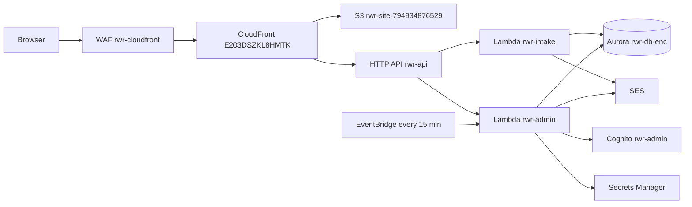

# Architecture

The marketing site and the admin are one Create React App build. CloudFront serves it from S3 and sends `/api/*` to an HTTP API. There is no separate VPC, load balancer, or container service.

## Request paths

- Pages, including `/admin` and `/session/{token}`, are static files. Unknown paths fall back to `index.html`.
- `POST /api/intake` is `rwr-intake`. It writes a row in `submissions` and emails hello@risingwithrachel.com.
- `/api/admin/*` is `rwr-admin`. Sign-in uses the Cognito user pool `rwr-admin` (pool id `us-east-1_xXsK9XZi4`). Later calls require a Cognito ID token.
- `/api/session/{token}` is public. The token is the credential for that one session.
- `POST /api/stripe/webhook` is `rwr-admin`. It answers as not found while the Stripe secret still holds placeholders.

## Data

Aurora PostgreSQL 16.9 Serverless v2, cluster `rwr-db-enc`, database `rwr`, reached only through the RDS Data API. The cluster is encrypted, not public, and keeps 7 days of backups. The Lambdas read `CLUSTER_ARN` and `SECRET_ARN`.

Tables: `submissions`, `clients`, `sessions`, `services`, `availability`, `payments`, and `schema_migrations`. `services` has no rows. `payments` stays empty until Stripe is live. Working hours are the single `availability` row: America/Chicago, Monday through Friday, 9:00 to 17:00.

The older unencrypted cluster `rwr-db` is still in the account and is not used by the app.

## Mail, calendar, and jobs

SES sends from hello@risingwithrachel.com. Inbound mail to that address is stored and forwarded by `rwr-forwarder` to Rachel.

`rwr-admin` reads `rwr-google-calendar` and `rwr-stripe` from Secrets Manager. Placeholder values are ignored. A session row records `calendar_sync_status` so a later credential change does not pretend an event was created.

EventBridge rule `rwr-session-reminders` invokes `rwr-admin` every 15 minutes. The function sends the 24-hour and 1-hour reminders and marks the session so the same reminder is not sent twice.

## Deploy and protection

A push to `main` in prodway-ai-ent/risingwithrachel assumes role `rwr-github-deploy` with GitHub OIDC, syncs the site build to S3, and invalidates CloudFront. That workflow does not publish Lambda code. Lambda updates are a manual zip of `backend/admin/index.mjs` or `backend/intake/index.mjs`.

CloudFront web ACL `rwr-cloudfront` blocks known-bad inputs, addresses on the Amazon IP reputation list, and an address that sends more than 2,000 requests in five minutes. The common rule set is on, with body-size and missing-user-agent checks counted rather than blocked so inquiry text is not rejected. Alarms publish to the SNS topic `rwr-alerts`.
